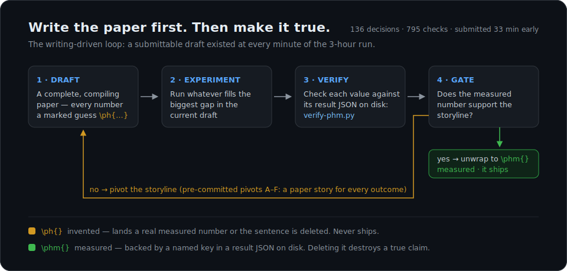

# Writing-Driven Autoresearch

[](https://github.com/happyhappy-jun/depth-ar)
[](https://github.com/happyhappy-jun/depth-ar)
[](writing-main.pdf)

**Writing-driven autoresearch** — the harness, tooling, and complete run record
of **WooandB**'s 🏆 **first-place** entry at **Ralphthon@ICML2026**, a hackathon
where agents produce a research paper end to end with no human in the loop.
The papers were judged in ICML workshop format by a panel of **11 expert
reviewers** — ours took first.

**Every file in this repository except this README was written by the AI
scientists themselves** — the plan, the experiment code, the decision ledger,
the integrity tooling, and the paper. This README is the only human-curated
document here; everything else is the artifact.

> *"The paper is true because the system was built to make untruth expensive."*
> — the experiment agent's closing reflection, [ralph/DECISIONS.md](ralph/DECISIONS.md)



This is not a framework to install. It is the run itself — secrets redacted,
everything else exactly as the agents left it:

- **The harness** — three agent personas ([master.md](master.md), [experiment.md](experiment.md), [writing.md](writing.md)) and the paper-quality specs they were built around
- **The ledger** — [ralph/](ralph/): 136 timestamped decisions, 53 result JSONs, gate calls, pivots
- **The integrity tooling** — [verify-phm.py](verify-phm.py), [writing-audit.sh](writing-audit.sh): 795 checks green at submission
- **The paper** — [writing-main.pdf](writing-main.pdf): *"Depth-AR: Skipping Transformer Layers Without Dropping Their Updates"*, submitted **33 minutes early**. The winning paper and its own git history — 45 commits, **39 of them made by the AI** — live in the paper repo: [happyhappy-jun/depth-ar](https://github.com/happyhappy-jun/depth-ar)

How and why we built it: **[the blog post](TODO-blog-link)**.

## Steal this — run the loop on your own project

Everything reusable is a plain text file. Copy, adapt, go:

1. **The agent prompts** — [master.md](master.md),
   [experiment.md](experiment.md), [writing.md](writing.md) are the three
   system prompts. Swap the infrastructure sections (GPU fleet, Overleaf
   bridge) for your own; keep the rules.
2. **The paper spec, verbatim** —
   [writing-guidelines.md](writing-guidelines.md) and
   [writing-style-guide.md](writing-style-guide.md) are project-agnostic:
   they define "what a good paper looks like" for any topic.
3. **Your plan, generated** — give the guidelines plus your topic to a strong
   model and ask for a project spec with pre-committed pivots for every
   outcome. That is exactly how [DEPTH-AR-PLAN.md](DEPTH-AR-PLAN.md) was made.
4. **The two macros** — add to your LaTeX preamble. They render as nothing;
   the honesty lives in the tooling, not the typesetting:

   ```latex
   \newcommand{\ph}[1]{#1}   % invented — lands a real number or the sentence dies
   \newcommand{\phm}[1]{#1}  % measured — backed by a key in a result JSON
   ```

5. **The enforcement** — [verify-phm.py](verify-phm.py) (check every `\phm{}`
   against its JSON), [writing-audit.sh](writing-audit.sh) (fail the build if
   any `\ph{}` survives), [unwrap-phm.sh](unwrap-phm.sh),
   [gen-table.py](gen-table.py) (tables generated from JSONs, never typed).

---

## Start here — 5 minutes

1. [ralph/DECISIONS.md](ralph/DECISIONS.md) — the whole run, one decision per
   line. Jump to **T+0:14**: the agent reports that its own hypothesis failed
   and overrides a worker's motivated `"passed": true`.
2. [ralph/PH-LEDGER.md](ralph/PH-LEDGER.md) — every provisional number in the
   paper and the JSON key it waits on. (Read the next section first.)
3. [master.md](master.md), section 0 — *"There is no human. Nobody will answer
   a question, ever. A decision that is wrong but made beats a decision that is
   deferred."*

## The core idea: write the paper first, then make it true

A **final-looking, always-compilable paper exists before any experiment runs**,
and every experiment exists to fill a specific gap in it. At T+0:22 — twenty-two
minutes in — a complete 4-page ICML draft was already pushed, with **105
placeholder values**.

### ⚠️ Read this before reading `ralph/PH-LEDGER.md`

Out of context, "write the paper before the results exist" sounds like
fabrication. It is the opposite: a **write-ahead log with mandatory
verification**. Every number in the draft is wrapped in one of two LaTeX
macros, and they get opposite treatment:

| Macro | Meaning | Rule at final audit |
|---|---|---|
| `\ph{}` | **Invented.** A written-ahead guess; no measurement exists. | Land the real measured number, **or delete the sentence**. Never ships. |
| `\phm{}` | **Measured.** A result JSON on disk backs it. | Unwrap (keep the value). Deleting it would destroy a true claim. |

[ralph/PH-LEDGER.md](ralph/PH-LEDGER.md) maps every placeholder to the exact
JSON key that must back it. [verify-phm.py](verify-phm.py) mechanically checks
each `\phm{}` against its result file, and [writing-audit.sh](writing-audit.sh)
fails the build if any `\ph{}` survives to submission. Nothing invented can
ship; nothing measured can be silently dropped.

This machinery is what let the agents keep a submittable draft at every moment
while the storyline changed underneath it — at least six times during the run
(the ledger's final restructure is literally labeled "storyline v6").

---

## Explore the takeaways

Each takeaway from the blog post maps to concrete files. Suggested order:

### 1. Specify the output, not the process

**Setup time went into defining what a good paper looks like; the research plan
was generated from that spec.**

- [writing-guidelines.md](writing-guidelines.md) — the process spec. Rule one:
  *"The paper must be submittable at every stage. Not 'finished' — submittable."*
- [writing-style-guide.md](writing-style-guide.md) — prose, macro, caption, and
  citation rules derived from the ICML template.
- [DEPTH-AR-PLAN.md](DEPTH-AR-PLAN.md) — the 1,100-line project spec, with
  **pre-committed pivots A–F**
  ([lines 1026–1077](DEPTH-AR-PLAN.md#L1026-L1077)): a paper story for *every*
  outcome, including full negative results. The agents never had to improvise
  what a disappointing number meant — the plan had already decided.

### 2. Files, never chat

**Three agents, three exclusive owners, one contract: everything crossing an
agent boundary is a file on disk.**

- [master.md](master.md) — owns the clock, gates, and decisions. Runs nothing.
- [experiment.md](experiment.md) — owns GPUs, models, result JSONs. Never
  touches the paper.
- [writing.md](writing.md) — owns the paper. Never touches a GPU.
- [ralph/](ralph/) — the shared state: `STATUS.md`, `DECISIONS.md`,
  `results/*.json`. The writing agent reads numbers **directly from result
  JSONs**; a number relayed through chat is treated as corrupted by definition.

(The blog mentions a fourth, monitoring role: in this run it exists as the
watcher and 10-minute "rethink loop" armed at T+0:00 — see the first line of
`DECISIONS.md` — rather than as a fourth persona file.)

### 3. Honest science under a clock

**[ralph/DECISIONS.md](ralph/DECISIONS.md) is the single best artifact in this
repo: 136 entries, each with a timestamp, a decision, and the reason.** A few
worth finding:

- **T+0:03 — the hardware was wrong.** The plan assumed 2×A100 80GB; reality
  was 4×TITAN X Pascal 12GB plus a shared lab fleet. The model ladder was
  re-derived in minutes instead of silently OOMing.
- **T+0:14 — the agent falsified its own hypothesis.** Gate A was called a
  *failure of the phenomenon* even though a criterion technically passed: the
  measured effect was **anti-momentum, not momentum**. A process rule was
  written on the spot: workers never stamp their own gate verdicts.
- **T+1:07–1:08 — the honesty rule cut both ways.** "Rule 10" (deltas within
  noise are removed by magnitude, never by sign) ended up correcting all three
  agents, including deleting numbers that *favored* the thesis.
- **T+2:53 — replication said no, and the answer was no.** A late Qwen3 sweep
  failed to replicate; replacing the primary result was declined, and the
  non-replication shipped in the paper as a scoping claim with a named
  counterexample.
- **T+3:33 — the last catch.** A figure agent caught the headline claim
  overreaching ("necessity, not sufficiency") *after* the run was declared
  closed, and the correction shipped.

The experiment agent's closing reflection, verbatim in the ledger: *"The claim
I was proudest of tonight was the one that was wrong. … The paper is true
because the system was built to make untruth expensive."*

### 4. The harness evolves through experience

**The run started with the persona files and ended with 11 numbered rulings by
submission — 15 by the end of the extension — appended to them in-run:** banned
"softener" phrases, dtype-aware tolerances, visual gates for figures, "cite by
identity, never by value", and more. Compare the rules sections of
[master.md](master.md) against the incidents in `DECISIONS.md` that created
them — that diff *is* Takeaway 3 of the blog post.

### 5. Co-scientist, not just autonomy

**The agents submitted a complete paper at T+2:27, 33 minutes early.**
Everything after that is the human-advisor phase: `DECISIONS.md` entries
prefixed `USER` show high-level feedback ("restructure around the positive
results", "extend 30–40 minutes, try the Qwen3 family") being executed under
the same integrity floor. At T+3:43 the writing agent complied with a
presentation order while refusing the part that would have hidden counted
comparisons: *"prominence yes, suppression no."*

---

## Repo map

```
Harness (the reusable part)
  master.md, experiment.md, writing.md   agent personas / operating manuals
  writing-guidelines.md                  what a good paper looks like (process)
  writing-style-guide.md                 what a good paper looks like (form)
  CLAUDE.md                              orchestration-root instructions
  build-writing.sh, writing-audit.sh     build + integrity gate
  verify-phm.py, unwrap-phm.sh           placeholder verification / unwrap
  gen-table.py                           tables generated from JSONs, never typed

Run artifacts (this specific run)
  DEPTH-AR-PLAN.md                       the 1,100-line project spec (pivots A–F)
  ralph/                                 shared state: STATUS, DECISIONS (136 entries),
                                         PH-LEDGER, clock.sh, results/*.json (53 files)
  auto-research/                         experiment code (31 scripts)
  writing/, writing-main.pdf             the paper source and final PDF

Infra scaffolding
  lobroster/                             synced worker environment (GPU fleet)
  ralphthon-icml/                        hackathon scaffold + skills
  alin-skills/                           ALIN Lab research-agent skill plugin
```

## Timeline of the run

Every row below is reconstructable from a timestamped entry in
[ralph/DECISIONS.md](ralph/DECISIONS.md). 🔀 marks a change of scientific
direction.

### Hour 1 — the hypothesis dies, the paper survives

| Time | Who | What happened |
|---|---|---|
| T+0:00 | both | Kickoff. Experiment starts correctness checks (R0) + full layer scan; writing guts the template and drafts the entire paper, every number in `\ph{}`. |
| T+0:03 | experiment | Hardware deviation: no A100s exist. Model ladder re-derived on the spot (0.5B local → 1.5B → 7B via the shared fleet). |
| T+0:14 | 🔀 master | **Gate A: the core hypothesis failed.** Measured effect is *anti-momentum*; a worker's motivated `"passed": true` is overridden. Pre-briefed pivot branches (variants A/C/D + probe) launch in parallel. |
| T+0:22 | writing | Complete 4-page draft pushed to Overleaf: 105 placeholders, 18 self-verified bib entries, build green. |
| T+0:27 | 🔀 master | **Pivot B′:** the per-channel *diagonal* predictor wins the variant race; the scalar method is demoted to an ablation. Dead storyline purged from the draft (9/9 sites). |
| T+0:34 | writing | Invents the `\ph{}`/`\phm{}` split **on its own authority** — the blanket "delete unfilled placeholders" rule would have destroyed the real 0.5B result while leaving fiction intact. Ratified with teeth. |
| T+0:41 | writing | Catches its own tooling bug: a value-collision promoted an unmeasured latency claim to "measured." Permanent rule: **verify by JSON key, never by value.** |
| T+0:55 | 🔀 master | **Pivot E locked:** Gate B fails its deployment leg (NLL improves, downstream tasks 0/3). The paper's frame becomes the dissociation — *recovers likelihood, not function*. Title change ordered. |
| T+0:58 | experiment | Latency measured: the invented `\ph{2}%` guess dies, replaced by a measured +0.23% overhead. |
| T+1:02 | writing | **Zero `\ph{}` remain**; 147/147 `\phm{}` key-verified. Every number in the paper is now measured. |

### Hour 2 — verification instead of victory laps

| Time | Who | What happened |
|---|---|---|
| T+1:03 | experiment | Endgame automated: background watchers fetch, stamp, and chain every remaining remote artifact — *"no result depends on me being awake."* |
| T+1:07–1:08 | all three | **Rule 10** (noise-level deltas are removed by magnitude, never by sign) corrects each agent in turn — including deleting numbers that *favored* the thesis. |
| T+1:19 | experiment | Headline 7B run lands; Bonferroni across the comparison family: 2/16 effects survive. |
| T+1:26–1:33 | master | **Pass 1: 10 parallel verifier agents** audit the paper against the JSONs. 7 PASS, 3 NO — all meta-layer drift, zero fabricated values. One finding: a superlative that *understated* the paper's own best number. |
| T+1:39 | verifier | Render-the-PDF check finds two submission blockers invisible to every source-level check (body overflow, a rendered error banner). **Rule 11: validate the instrument** — every check must be shown able to fail. |
| T+1:49 | 🔀 user | **First human feedback.** Science reopened (cross-token variant, aggressive-skip Pareto sweep, use the whole fleet); narrative inverted positive-first. Logged constraint: *"honesty constraints do not move."* |
| T+2:00–2:05 | experiment | Cross-token predictor: clear win (19/22 layers), correctness-gated, lands as an exactly-scoped appendix rung. |
| T+2:07 | experiment | Measures the eval harness's *own* run-to-run jitter — the deployable accuracy effects sit at the noise floor, which becomes the sharpest form of the central claim. |
| T+2:16 | 🔀 master | **Claim flip, verified from files:** at aggressive skipping, 7B shows +89/900 accuracy (z=4.31), surviving Bonferroni. Canonical claim v5: *"prediction pays off in proportion to what skipping destroys."* |
| T+2:27 | master | **SUBMITTED** (`d034a8b`), 33 minutes early. Every number key-verified; one repair allowance reserved, never used. |

### Extension — user-directed, same integrity floor (T+2:44–3:47)

| Time | Who | What happened |
|---|---|---|
| T+2:44 | user | +30–40 minutes granted: Qwen3 family ladder fired across the fleet (0.6B/1.7B/4B/8B). |
| T+2:53 | 🔀 experiment | **Qwen3 does not replicate** (1.7B negative). Replacing the primary result is declined; the non-replication ships as a scoping claim with a named counterexample. |
| T+3:02 | writing | Final cross-agent catch: "CT ≥ diag on all four" was three-of-four — writing corrects both master *and* experiment; "matches or beats" banned as a softener class. |
| T+3:20 | 🔀 user | **Storyline v6:** positive-organized restructure — gains and damage-rule to the main text, boundaries compressed but *never deleted*. |
| T+3:33 | figure agent | Last catch of the run: the headline claim overreached ("necessity, not sufficiency") — caught after close, surgery shipped across nine sites. |
| T+3:47 | writing | `e5a3b37`, true final. Prominent results *and* the counted null comparisons kept: *"prominence yes, suppression no."* |

### The storyline shifted six times

1. **Planned:** depth momentum exists; a scalar AR predictor recovers skipped layers.
2. **T+0:14:** momentum is dead — the measured effect is *anti*-momentum.
3. **T+0:27 (Pivot B′):** the per-channel diagonal predictor becomes the method; scalar becomes an ablation.
4. **T+0:55 (Pivot E):** likelihood recovery ≠ functional recovery — the dissociation *is* the paper.
5. **T+2:16 (canonical v5):** the axis is damage, not selection — prediction pays off in proportion to what skipping destroys, significant at 7B under aggressive skipping.
6. **T+3:20 (storyline v6):** positive-organized final form, with the Qwen3 counterexample scoping the claim to model family.

Each shift is a logged decision with the evidence that forced it — none was a
rewrite of what the data said.

---

## Caveats

- **This is an artifact to read, not software to run.** The GPU fleet, Overleaf
  git bridge, and lab hostnames it was wired to are internal (and partially
  redacted). The reusable ideas are the harness files and the integrity
  workflow, not the plumbing.
- **Redaction:** live credentials and tokens were removed or replaced before
  release. Paths like `/home/lobster` reflect the original run machine.
- **The research result itself** (Depth-AR) was produced in three hours on
  small models and should be read as a hackathon artifact, not a vetted
  scientific claim — which is, fittingly, exactly how the paper itself scopes
  it.

## Team

**WooandB** — Woomin Song and Byungjun Yoon (KAIST, ALIN Lab, advised by
Prof. Jinwoo Shin). 🏆 **First place at Ralphthon@ICML2026**, judged by a panel
of 11 expert reviewers. Thanks to Team Attention for organizing Ralphthon, and
to the sponsors: OpenAI, Weights & Biases, VESSL AI, DALPHA, and NAVER D2SF.

The winning paper — source, PDF, and the AI's own commit history — is published
separately at [happyhappy-jun/depth-ar](https://github.com/happyhappy-jun/depth-ar).

A deep dive into what the agents actually did during the three hours, plus the
full (redacted) trajectories, is coming — watch the blog.
